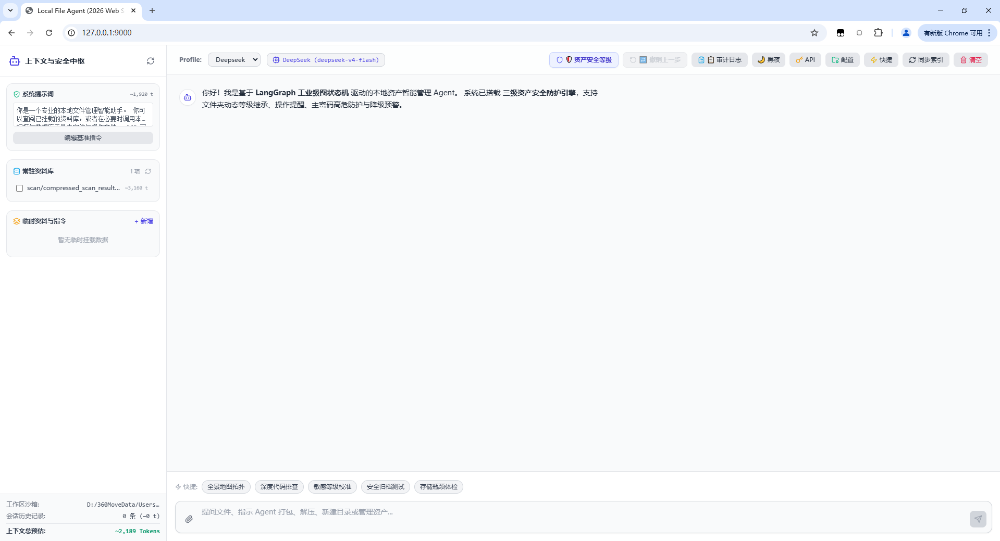
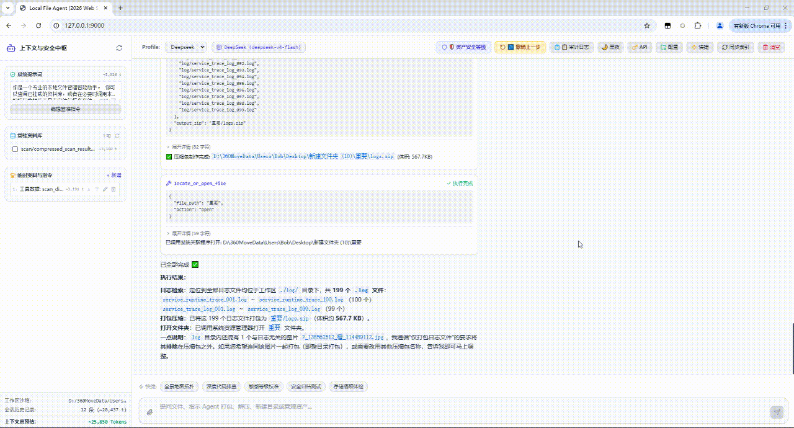
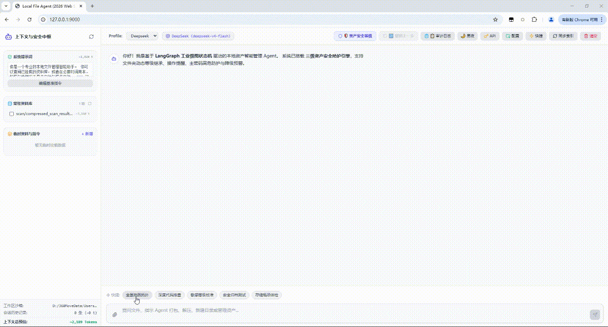
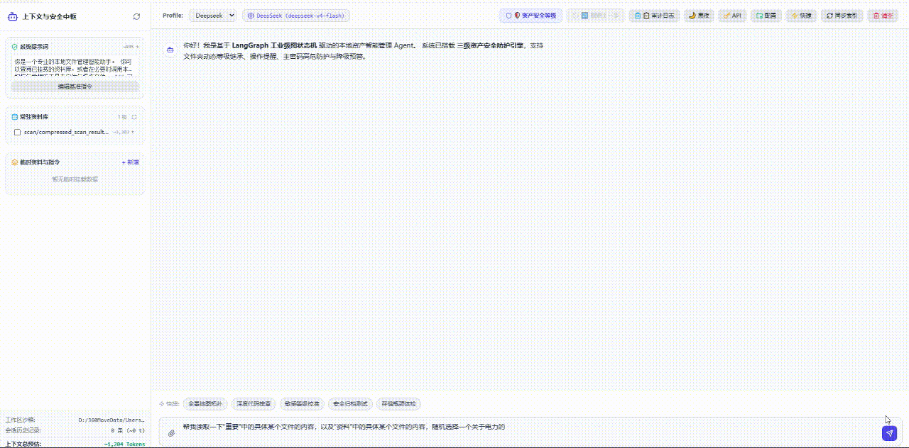
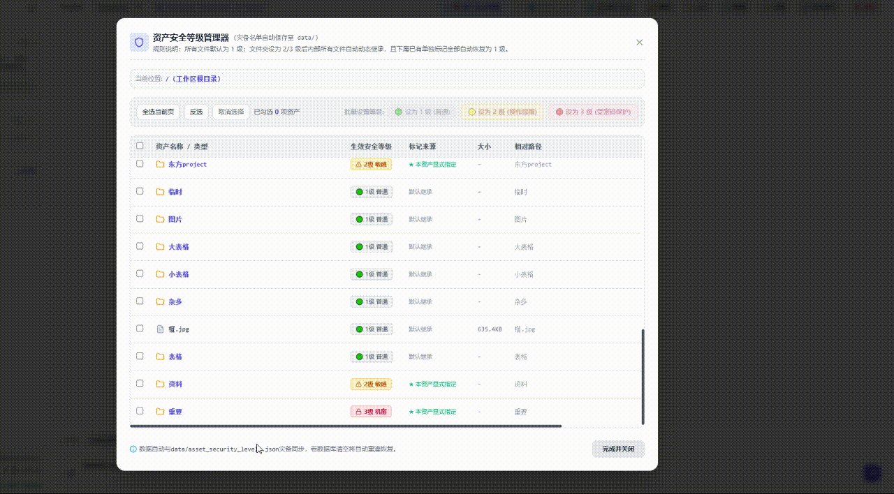
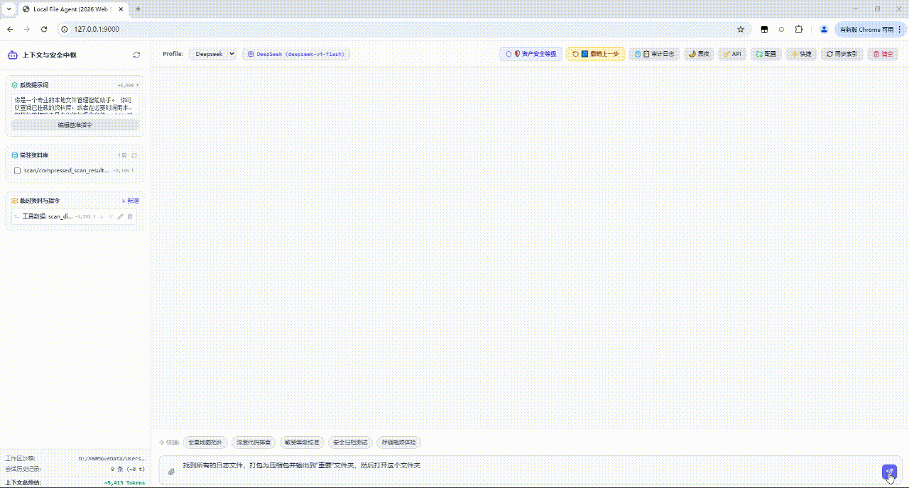

# Local File Agent (Web Edition)

`Local File Agent` 是一套基于 **LangGraph 异步图状态机** 与现代化轻量响应式 Web 技术栈构建的本地受控文件管理智能体系统。系统深度集成本地关系型数据库（**SQLite3 WAL + FTS5** 倒排索引）、嵌入式向量检索引擎（**LanceDB + Apache Arrow**），支持 OpenAI、DeepSeek、Claude、Gemini 以及本地 Ollama 等多种大语言模型端点。

系统针对大语言模型直接操作本地文件系统时的 **“越权破坏”、“幻觉覆盖”、“多步调用穿透”以及“上下文窗口超载”** 等现实工程问题进行针对性设计。通过人机协同网关（HITL）、三级资产安全模型、动态权限继承以及基于文件流水账的确定性回滚机制，在充分发挥智能体自主执行能力的同时，严守物理端侧数据安全底线。

<div align="center">
  
  <p><em>▲ 系统主控制台全景：集成流式思考链、多 Profile 切换、无 Agent 事务撤销探针与细粒度资产安全管理</em></p>
</div>

---

## 目录
- [背景与核心痛点分析](#背景与核心痛点分析)
- [核心功能实战演示 (GIF 矩阵)](#核心功能实战演示-gif-矩阵)
  - [1. 交互控制台与全局状态感知](#1-交互控制台与全局状态感知)
  - [2. 目录树扫描与模板诱导压缩](#2-目录树扫描与模板诱导压缩)
  - [3. 细粒度资产鉴权：敏感与机密资产按级读取](#3-细粒度资产鉴权敏感与机密资产按级读取)
  - [4. 智能体自主安全治理：安全降级挂起拦截](#4-智能体自主安全治理安全降级挂起拦截)
  - [5. 混合检索定位与原子安全打包](#5-混合检索定位与原子安全打包)
- [完整项目目录图谱](#完整项目目录图谱)
- [文件职责与模块矩阵](#文件职责与模块矩阵)
- [核心工程机制与关键实现](#核心工程机制与关键实现)
  - [1. 批处理断路保护机制 (Circuit-Breaker Batch Execution)](#1-批处理断路保护机制-circuit-breaker-batch-execution)
  - [2. 基于文件拓扑的三级安全模型与动态继承](#2-基于文件拓扑的三级安全模型与动态继承)
  - [3. 确定性文件流水账回滚系统 (Journal-based Undo)](#3-确定性文件流水账回滚系统-journal-based-undo)
  - [4. 物理操作前置防御引擎 (Pre-check Engine)](#4-物理操作前置防御引擎-pre-check-engine)
  - [5. 轻量级全离线混合检索 (Dense + Sparse Hybrid Search via RRF)](#5-轻量级全离线混合检索-dense--sparse-hybrid-search-via-rrf)
  - [6. 实测性能基准与压缩效果指标 (Benchmarks & Metrics)](#6-实测性能基准与压缩效果指标-benchmarks--metrics)
- [15 项受控工具强类型契约矩阵](#15-项受控工具强类型契约矩阵)
- [系统架构与时序交互图](#系统架构与时序交互图)
- [已知工程边界与设计权衡 (Known Limitations & Trade-offs)](#已知工程边界与设计权衡-known-limitations--trade-offs)
- [快速启动与部署说明](#快速启动与部署说明)
- [技术栈与环境依赖](#技术栈与环境依赖)

---

## 背景与核心痛点分析

大语言模型（LLM）直接接入操作系统物理文件管理时，面临一系列严重的可靠性与安全性挑战：

| 现实痛点场景 | 传统 Agent 方案缺陷 | 本系统工程对策 |
| :--- | :--- | :--- |
| **上下文溢出与成本超载** | 遍历中大型项目目录生成数万行文件树，瞬间撑爆上下文窗口或产生高昂 Token 开销。 | **分层时间切片（80/10/10 抽样）** + **正则模式诱导压缩**，将高熵重复结构归纳折叠为通用骨架。 |
| **机密泄漏与权限无差** | 模型无差别访问工作区中的私有文件（如密钥、敏感配置），缺乏细粒度保护。 | **三级资产安全模型（Level 1~3）**：2 级人工确认，3 级**强制核验主管理密码**，且支持目录动态继承。 |
| **越权降级与逃逸移动** | 用户指令让 Agent 将高密文件移出至外部，原有防护在移入普通目录后失效。 | **跨目录降级防御与状态真抹标**：高等级移入低等级目录判定为降级风险，强行挂起警报并重置底层元数据。 |
| **多工具连环穿透** | 模型单轮输出多个 Tool Calls，第一个操作被用户取消后，后续调用依然盲目执行。 | **LangGraph 批处理断路节点（Circuit-Breaker）**：前序调用被拒或异常时，批次后续工具秒级熔断阻断。 |
| **破坏性误覆盖与误删除** | 操作同名文件时直接覆写，或直接调用 `rm` 物理粉碎核心源资产。 | **冲突分流（免密换名 vs 密码覆盖备份）**；删除仅入系统回收站；所有覆写操作在备份区生成暂存快照。 |
| **撤销依赖 LLM 二次幻觉** | 用户提示“撤销刚刚的操作”，模型常因记忆偏差或缺乏环境感知产生二次破坏。 | **确定性文件流水账（Journal-based Undo）**：完全脱离 LLM，后端线程安全锁驱动物理原子还原。 |

---

## 核心功能实战演示 (GIF 矩阵)

### 1. 交互控制台与全局状态感知
基于 FastAPI + SSE 搭建的响应式 Web 控制台，集成流式思考链解析、工具执行状态看板、顶栏无 Agent 原生原子撤销探针与资产快速标注。

<div align="center">
  
  <p><em>▲ 图 1：系统主控制中心与运行状态看板</em></p>
</div>

---

### 2. 目录树扫描与模板诱导压缩
针对深层物理磁盘，系统采用分层时间切片（80/10/10 策略）快速遍历，并通过文件名通配诱导折叠算法将全景目录树压缩载入上下文临时资料库。

<div align="center">
  
  <p><em>▲ 图 2：宏观物理扫描与目录压缩地图生成过程</em></p>
</div>

---

### 3. 细粒度资产鉴权：敏感与机密资产按级读取
系统根据资产的生效安全级别实施差异化动态鉴权：读取受 2 级保护的敏感文件时弹出人机协同确认窗口；读取受 3 级保护的高危机密资产时，切面网关强制定级为破坏性高危动作并**强制核验主管理密码**。

<div align="center">
  
  <p><em>▲ 图 3：同类读取操作按 2 级敏感与 3 级机密实施差异化拦截与主密码鉴权</em></p>
</div>

---

### 4. 智能体自主安全治理：安全降级挂起拦截
大模型可通过调用 `set_security_level` 自主管理资产权限。当模型尝试将受保护的目录安全级别调低时，底层切面识别到“安全降级风险”，立即挂起后端执行流并向前端推送降级严重警报，杜绝权限悄然削弱。

<div align="center">
  
  <p><em>▲ 图 4：Agent 自主触发目录降级并被系统人机协同网关阻断</em></p>
</div>

---

### 5. 混合检索定位与原子安全打包
智能体依据自然语言意图调用 RRF 混合检索算法定位目标资产，通过磁盘余量前置预检后安全打包为 ZIP 归档，并在流水表中记录原子撤销凭证。

<div align="center">
  
  <p><em>▲ 图 5：多路检索、空间预检与安全压缩打包全流程</em></p>
</div>

---

## 完整项目目录图谱

```text
Local-File-Agent/
│
├── config/                          # [配置持久层] 运行时配置、声明式安全策略与凭证
│   ├── API_config.json              # 大模型多 Profile 配置（设备指纹混淆密文存储）
│   ├── config.json                  # 主程序运行配置（工作区根目录、扫描深度、黑名单、Token阈值、主密码散列）
│   ├── fast_chat.json               # 快捷指令预设定义
│   └── security_policy.json         # 15 大工具声明式安全策略、动态别名与单工具豁免表
│
├── core/                            # [核心系统层] 图内核编排、存储底座与安全管控中枢
│   ├── agent_graph_web.py           # Web 异步 LangGraph 图状态机、SafeAsyncToolBatchNode 批处理断路节点
│   ├── indexer_engine.py            # SQLite3 WAL + FTS5 与 LanceDB 双库引擎；流水表、审计表与实体级联
│   ├── model_factory.py             # 统一模型工厂：OpenAI/DeepSeek/Claude/Gemini 原生参数清洗与反向代理适配
│   ├── security.py                  # 安全管控中枢：AssetSecurityManager 单例、mtime 热感知、降级抹标、物理预检
│   └── tokenizer.py                 # 本地离线多平台 Token 计数器（适配 OpenAI cl100k 与 Gemini 拟合算法）
│
├── data/                            # [数据持久层] 索引库、向量表、宏观扫描快照与常驻资料
│   ├── asset_security_levels.json   # 【核心灾备】非 1 级资产显式等级独立清单 (相对路径持久化，冷启动自愈)
│   ├── database/                    # SQLite 关系型数据库目录 (file_indexer.db)
│   ├── lancedb/                     # LanceDB 本地向量表目录 (file_embeddings)
│   └── scan/                        # 磁盘物理扫描原始 JSON 快照与聚类压缩 Markdown 地图
│
├── tools/                           # [业务工具层] 强类型契约工具与提示词装配
│   ├── agent_tools_web.py           # Web 强契约工具工厂：全量 15 大工具统一切面拦截、Pydantic Schema 约束
│   ├── file_manager_tool.py         # 资产操作实现：AI重命名自愈、安全等级设定、降级抹标、原子撤销执行器
│   ├── prompt_manager.py            # 提示词上下文与会话事务管理器（事务快照回滚、工作区基准锚定）
│   ├── scan_indexer.py              # 地图聚类压缩引擎：数字模式诱导、两阶段深度压缩、兄弟目录聚合
│   └── scanner.py                   # 磁盘物理扫描器：分层时间切片（80/10/10 策略）、目录预算熔断与死循环防御
│
├── web/                             # [界面表现层] 现代响应式前端（免构建、零 npm 依赖）
│   ├── vendor/                      # 本地离线第三方静态库 (Tailwind, Vue, Lucide, Highlight, Markdown-it)
│   ├── app.js                       # Vue 3 核心驱动：SSE 流式拼装、撤销状态探针、HITL 冲突分流与密码核验
│   └── index.html                   # 资产管理面板防折行排版、审计日志看板、HITL 鉴权模态框
│
├── run_web.py                       # 【程序启动入口】可用端口探测、浏览器自动拉起与 Uvicorn 引导
└── server.py                        # 【API 与服务中枢】FastAPI 后端、单例注入、升降级切面拦截、HITL 鉴权
```

---

## 文件职责与模块矩阵

### 1. 服务调度与启动入口

| 文件名 | 模块归属 | 核心职责说明 |
| :--- | :---: | :--- |
| **`run_web.py`** | 启动入口 | 自动在 `[9000, 9050)` 区间探测未占用端口；服务就绪后后台子线程延迟 1.2 秒自动拉起系统默认浏览器；引导运行 `uvicorn.run("server:app")`。 |
| **`server.py`** | 服务核心 | FastAPI 后端网关；全局单例绑定；**接入 `set_security_level` 升降级切面拦截与主密码核验**；**实现同名冲突前置挂起**；提供原生撤销端点 (`POST /api/fs/undo`) 与状态探针；审计日志查询。 |

---

### 2. `core/` 核心图引擎、存储与安全中枢

| 文件名 | 模块归属 | 核心职责说明 |
| :--- | :---: | :--- |
| **`security.py`** | 安全中枢 | **`AssetSecurityManager` 进程级单例**，搭载 `_check_and_reload` 磁盘变动热感知；**跨目录降级全员抹标机制 (`handle_transfer_security_levels`)**；全平台 Windows 路径大小写归一化；PBKDF2 加盐散列；**5 维物理危险预检引擎**。 |
| **`indexer_engine.py`** | 数据引擎 | 管理 SQLite3 WAL 模式与 LanceDB 向量表；维护 **`operation_journal`（流水表）** 与 **`audit_logs`（审计表）**；启动清库后依据 `data/asset_security_levels.json` 自动灾备重灌安全等级；**底层物理重命名与子目录级联同步**。 |
| **`agent_graph_web.py`** | 图状态机 | 编译强类型 `WebAgentState` 循环图；实现 **`SafeAsyncToolBatchNode`（前序被拒后续秒级短路断路器）**；内置 `WebThinkingStreamParser`（提取 `<think>` 流）与正文 Markdown JSON 容错反解。 |
| **`model_factory.py`** | 模型适配 | 统一构建 OpenAI、DeepSeek、Claude、Gemini 标准实例；自动清洗反向代理与端点协议前缀。 |
| **`tokenizer.py`** | 分词估算 | 本地离线多平台 Token 计数器；适配 OpenAI/DeepSeek (BPE cl100k) 与 Gemini 专用拟合规则。 |

---

### 3. `tools/` 提示词装配与专业工具套件

| 文件名 | 模块归属 | 核心职责说明 |
| :--- | :---: | :--- |
| **`agent_tools_web.py`** | 工具契约 | 采用 Pydantic 严格约束输入 Schema；**管理 15 项受控工具**；全量工具统一切面拦截（`_check_security`）。 |
| **`file_manager_tool.py`** | 资产管理 | **`set_security_level` 核心实现（物理/数据库/灾备/撤销流水四重联动）**；**重写 `rename_file` 智能自愈解析（支持未入库即时建索）**；原地移动自愈反馈；移动降级真实抹标；原生原子撤销引擎 (`undo_last_operation`)。 |
| **`prompt_manager.py`** | 提示词与事务 | 动态组装工作区沙箱物理基准；注入 15 项工具清单、安全设级原则与重命名规范；免密换名 vs 密码覆盖原则；会话事务管理（`begin` / `rollback` / `commit`）。 |
| **`scan_indexer.py`** | 聚类压缩 | 分析文件名数字模式诱导归纳正则模板；提供标准与二次深度压缩双模式；相似兄弟目录聚合折叠。 |
| **`scanner.py`** | 物理扫描 | 单目录 3000 项遍历预算熔断与软链接死循环防御；分层时间切片算法快速构建全景文件树。 |

---

### 4. `config/` 策略配置与 `web/` 交互界面

| 文件名 | 模块归属 | 核心职责说明 |
| :--- | :---: | :--- |
| **`security_policy.json`** | 策略配置 | 外部解耦安全规则表。定义 15 项动作的基础风险等级（`base_level`）、操作说明、动作别名映射（`aliases`）与单工具免确认清单（`tool_exemptions`）。 |
| **`index.html`** | 页面骨架 | 资产安全管理面板加固（`whitespace-nowrap`、列宽保护）；顶栏集成【↩ 撤销上一步】与【📋 审计日志】；HITL 模态框清晰分离【更名免密】与【覆盖密码】。 |
| **`app.js`** | 交互驱动 | 基于 Vue 3 构建；SSE 流式增量拼装；撤销状态探针与按钮置灰控制；资产管理面板浏览、单选、多选、全选、反选与批量设级。 |

---

## 核心工程机制与关键实现

### 1. 批处理断路保护机制 (Circuit-Breaker Batch Execution)
原生 Agent 框架在处理单轮多个 `tool_calls` 时常按顺序盲目执行。若批次中某个工具触发安全拦截被用户拒绝，后续工具仍会依据“假设前序操作已成功”的错误前提继续调用，引发链式误改。

本项目在 `core/agent_graph_web.py` 中实现了自定义的 `SafeAsyncToolBatchNode`：
```text
[LLM Tool Calls: Tool_A, Tool_B, Tool_C]
           │
           ▼
     [执行 Tool_A] ──► 用户在 HITL 弹窗中点击【取消操作】
           │
           ├──► 触发断路熔断 (batch_interrupted = True)
           │
           ├──► Tool_B ──► [直接短路跳过，自动回填废弃说明]
           └──► Tool_C ──► [直接短路跳过，自动回填废弃说明]
           │
           ▼
     [状态流转至 Agent / END] (彻底阻断磁盘与后续动作)
```

---

### 2. 基于文件拓扑的三级安全模型与动态继承
系统将沙箱内资产划分为 3 级保护规范：
* **Level 1 (普通，默认)**：常规工作区文件，遵循声明式策略放行；
* **Level 2 (敏感)**：涉及该资产的读写、移动、重命名操作强制触发 Web 模态框确认；
* **Level 3 (机密)**：涉及此类资产的所有物理操作及内容读取，**必须核验 PBKDF2 加盐主管理密码**。

#### 动态继承与全员降级机制
1. **拓扑动态继承**：任意目录标记为 2 级或 3 级后，其下所有子文件和子目录的生效等级动态提升为该父级最高等级：
   $$\text{EffectiveLevel}(P) = \max \left( \text{ExplicitLevel}(P), \max_{A \in \text{Ancestors}(P)} \text{ExplicitLevel}(A) \right)$$
2. **父级统领清理**：目录设置 2/3 级后，系统自动清空其内部已单独打标的子项（恢复为 1 级显式），统一由目录动态继承管理；
3. **跨目录移动降级真实生效**：当资产从高等级目录剪切至低等级目录时，系统阻断并提示全员降级警报。授权后，底层调用 `handle_transfer_security_levels(..., is_downgrade=True)`，彻底抹除原显式记录并级联更新 SQLite `files.security_level`；
4. **单例与热感知架构**：`AssetSecurityManager` 在进程中以单例维护，搭载基于磁盘文件 `mtime` 的变动感知器，保证前端面板操作与安全网关拦截始终读取一致的内存缓存。

---

### 3. 确定性文件流水账回滚系统 (Journal-based Undo)
用户点击顶栏“↩ 撤销上一步”时，执行确定性的本地事务回退逻辑：
* **无模型介入**：不向大模型发起任何请求，规避 LLM 对回滚逻辑的幻觉和执行偏差；
* **并发互斥控制**：后端使用 `asyncio.Lock()` 施加全局事务锁，撤回执行期间前端自动置灰输入与控制台；
* **全要素逆向反转**：
  * **移动**：将目标资产移回源路径，若源存在降级则自动恢复原显式安全等级；
  * **覆盖写**：从备份快照中将原文件原样恢复并更新检索索引；
  * **重命名**：反向改回原名称，级联更新倒排索引与向量记录；
  * **解压与打包**：物理清理释放的文件树或删除生成的压缩包；
  * **安全等级调整**：将资产等级回滚至操作前的显式设定；
* **生命周期隔离**：服务重启时自动清空操作流水栈（`operation_journal`），杜绝跨会话误撤回历史文件。

---

### 4. 物理操作前置防御引擎 (Pre-check Engine)
在任何涉及物理写入或变动动作前，系统在 `core/security.py` 中执行前置阻断检测：
* **磁盘空间预检**：所在分区可用空间不足 500MB，或预计写入后剩余空间低于安全线时直接熔断；
* **Zip Slip 路径穿越防御**：解压时检测条目是否包含 `../` 或脱离目标沙箱边界的绝对路径，检测到即刻阻断；
* **Zip 炸弹防御**：解压包解压膨胀比 > 100:1、总释放体积 > 2GB 或包含文件数 > 10,000 时拒绝解压；
* **符号链接越界检查**：拒绝直接对指向沙箱外部的软链接实施物理穿透操作；
* **同名冲突严格分流**：
  * **更换名称**：常规操作，允许用户重命名后**免密放行**；
  * **覆盖替换**：定级为破坏性高危动作，**强制验证主管理密码**，并在 `.local_agent_undo_backups` 产生原子备份。

---

### 5. 轻量级全离线混合检索 (Dense + Sparse Hybrid Search via RRF)
系统在不需要部署外部独立向量数据库进程的前提下，实现本地低资源高性能检索：
* **稠密向量召回 (Dense Retrieval)**：基于 `LanceDB + FastEmbed (BAAI/bge-small-zh-v1.5)`，纯 CPU 运行输出语义特征向量；
* **稀疏全文倒排召回 (Sparse Retrieval)**：基于 SQLite3 FTS5 引擎配合 `Jieba` 分词器建立全文倒排表；
* **精确文件特征过滤**：匹配文件路径与名称词干；
* **RRF (Reciprocal Rank Fusion) 倒数排名融合**：
  $$RRF\_Score(d) = \sum_{m \in M} \frac{w_m}{k + r_m(d)}$$
  综合语义、关键字与精确匹配结果，输出兼顾模糊语义与精确路径的检索排序。

---

### 6. 实测性能基准与压缩效果指标 (Benchmarks & Metrics)

在标准开发机器环境（Apple M2 / 16GB RAM，测试包含 12,400+ 个代码与数据文件的实际项目目录）下的实测运行指标如下：

| 评估维度 | 测试基准参数 | 实测性能与压缩比 | 业务效果与工程价值 |
| :--- | :--- | :--- | :--- |
| **全景目录树折叠** | 原始未压缩树：~185,000 Tokens | 压缩后地图：**~4,200 Tokens (减重 97.7%)** | 将上万文件的目录树安全载入各类模型单轮上下文窗口。 |
| **模式诱导解析开销** | 遍历并聚类 12,400+ 文件实体 | **纯 CPU 内存计算 < 65ms** | 毫秒级生成 Markdown 地图，无明显流式等待停顿。 |
| **RRF 混合检索端到端** | LanceDB 语义 + SQLite FTS5 倒排 | **总召回延迟 < 35ms** | 纯本地 CPU 推理，兼顾自然语言意图与代码精确符号定位。 |
| **原子撤销物理反转** | 包含 200 项文件的跨目录移动撤回 | **事务反转耗时 < 120ms** | 物理剪切复原与 SQLite 索引级联更新同步完成。 |

---

## 15 项受控工具强类型契约矩阵

所有工具均通过 Pydantic 严格约束参数，统一切入 `_check_security` 拦截网关：

| 工具名称 (`Tool Name`) | 参数模式 (`Schema`) | 基础风险定级 | 动态安全机制与冲突策略 |
| :--- | :--- | :---: | :--- |
| **`scan_directory`** | `EmptyInput` | 🟢 `SAFE` | 分层时间切片（80/10/10）物理遍历，聚类压缩后旁路挂载至临时资料库。 |
| **`search_files`** | `query`, `ext`, `parent_path`, `min_size_mb`, `max_size_mb`, `limit` | 🟢 `SAFE` | RRF 融合检索（向量 + FTS5 全文倒排 + 名称匹配），支持多维度属性过滤。 |
| **`read_file_content`** | `file_path`, `file_id`, `section` | 🟢 `SAFE` | 30KB/500行限额保护；**受资产等级保护：读 2 级弹窗确认，读 3 级机密强验主密码**。 |
| **`delete_file`** | `files` | 🔴 `DESTRUCTIVE` | 破坏性高危动作；移入系统回收站；明确提示不可通过撤销按钮自动还原。 |
| **`move_file`** | `files`, `target_dir`, `rename_to`, `overwrite` | 🟡 `SENSITIVE` | 批量剪切；**原地移动自愈反馈**；**跨目录降级全员抹标**；**同名冲突免密换名 vs 密码覆盖**。 |
| **`copy_file`** | `files`, `target_dir`, `rename_to`, `overwrite` | 🟢 `SAFE` | 副本复制；源文件受 2/3 级保护时弹窗拦截；同名冲突免密换名 vs 密码覆盖。 |
| **`create_directory`** | `dir_path` | 🟢 `SAFE` | 在沙箱内新建目录；已存在同名目录时阻断报错；支持撤销删除。 |
| **`write_file`** | `file_path`, `content`, `overwrite_name` | 🟡 `SENSITIVE` | 创建或写入文本文件；单次 5MB 限制；同名冲突免密换名 vs 密码覆盖。 |
| **`compress_files`** | `files`, `output_zip`, `rename_to` | 🟢 `SAFE` | 制作 ZIP 包；空间预检；同名压缩包存在时拦截提示换名；支持撤销删除。 |
| **`extract_archive`** | `zip_path`, `target_dir`, `overwrite` | 🟡 `SENSITIVE` | 安全解压；**强制 Zip Slip 路径穿越防御、压缩炸弹预检与冲突分流**。 |
| **`find_duplicate_files`**| `EmptyInput` | 🟢 `SAFE` | 基于 SHA-256 哈希比对工作区完全一致的冗余文件。 |
| **`get_storage_insights`** | `EmptyInput` | 🟢 `SAFE` | 生成磁盘存储透视体检报告，输出后缀分布与 Top10 大文件。 |
| **`rename_file`** | `file_path`, `file_id`, `new_name` | 🟡 `SENSITIVE` | **重命名文件或目录（智能路径解析、未入库即时建索）**；冲突前置拦截换名；支持撤销还原。 |
| **`set_security_level`** | `file_path`, `file_id`, `target_level` | 🟡 `SENSITIVE` | **调整资产安全等级（1/2/3）**；**升至 3 级验密；降级触发严重警报；目录设级清理子项**；支持撤销。 |
| **`locate_or_open_file`**| `file_id`, `file_path`, `action` | 🟢 `SAFE` | 在系统资源管理器中高亮定位，或直接调用系统关联软件打开文件。 |

---

## 系统架构与时序交互图

```text
[ 用户 / Web 前端 (Vue 3 + SSE) ]
            │
            ▼
┌─────────────────────────────────────────────────────────────┐
│                   FastAPI 服务与调度中心                     │
│  - SSE 事件流分发 (thought / text_delta / tool / hitl)       │
│  - 主密码 PBKDF2 鉴权与 API 凭证对称混淆解密                  │
│  - 原生原子事务锁 (asyncio.Lock -> Journal Undo)            │
└──────────────────────┬──────────────────────────────────────┘
                       │
                       ▼
┌─────────────────────────────────────────────────────────────┐
│             LangGraph 异步智能体图状态机                    │
│   [Agent Node]  <───>  [SafeAsyncToolBatchNode (断路器)]    │
└──────────────────────┬──────────────────────────────────────┘
                       │
                       ▼
┌─────────────────────────────────────────────────────────────┐
│                 切面安全网关 (Security Interceptor)         │
│  - 三级资产有效等级动态计算 (Max(自身显式, 祖先父级最高))      │
│  - 跨目录降级风险预检与同名冲突扫描                           │
│  - 物理前检：Zip Slip / 压缩炸弹 / 磁盘余量 / 软链接         │
│  - HITL 异步协程挂起 (asyncio.Event -> 等待用户授权)         │
└──────────────────────┬──────────────────────────────────────┘
                       │
        ┌──────────────┴──────────────┐
        ▼                             ▼
┌──────────────────────────┐  ┌────────────────────────────────┐
│   双存储引擎 (Storage)   │  │   物理文件系统 (Filesystem)    │
│ - SQLite WAL (资产/流水)  │  │ - 沙箱路径约束 (Sandbox Root)  │
│ - SQLite FTS5 (全文倒排) │  │ - 原地移动与自愈反馈           │
│ - LanceDB (向量索引)     │  │ - 覆盖备份快照 (.undo_backups) │
│ - 灾备 JSON (安全等级清单)│  │ - 系统回收站防护 (send2trash)  │
└──────────────────────────┘  └────────────────────────────────┘
```

---

## 已知工程边界与设计权衡 (Known Limitations & Trade-offs)

在系统设计与技术选型过程中，基于单机轻量化与运行可靠性进行了以下工程权衡：

1. **单机端侧定位 vs 分布式锁**：
   * 本系统聚焦于**本地开发者个人单工作区**场景。文件事务日志与 `global_undo_lock` 依赖单进程内存锁与 SQLite 本地 WAL 实现，未引入 Redis 或 Etcd 等外部分布式锁组件；
2. **嵌入式推理初始化开销**：
   * 为确保完全离线可用并降低资源占用，向量模块选型纯 CPU 推理的 `FastEmbed (BAAI/bge-small-zh-v1.5)`。服务冷启动初次执行向量嵌入时，存在约 1.5 ~ 2.5 秒的 ONNX 模型加载与探测耗时，模型装载完毕后进入常驻毫秒级推理；
3. **回收站隔离与撤销设计边界**：
   * 破坏性删除（`delete_file`）直接借助操作系统底层能力（`send2trash` / Windows Shell API / macOS AppleScript）投递至回收站。为防止误删操作在流水撤回时引发级联覆盖冲突，**系统显式禁止撤销栈自动反向捞回已入回收站的资产**，需由用户在操作系统原生回收站中按需手工还原；
4. **长文本分块截断预算**：
   * 针对超大文件读取（`read_file_content`），系统实施单次 30KB / 500 行硬顶分段保护，防止极大文件读取引发上下文即刻溢出。大文件深度分析依赖切片（head/middle/tail）按需提取。

---

## 快速启动与部署说明

### 1. 环境准备
确保已安装 Python 3.9 或更高版本。安装核心依赖库：
```bash
pip install fastapi uvicorn pydantic \
    langgraph langchain-core langchain-openai langchain-anthropic langchain-google-genai \
    lancedb pyarrow fastembed jieba tiktoken send2trash requests
```
*(可选支持：安装 `python-docx`、`pypdf`、`pillow` 可自动激活 Word、PDF 文档与图片 EXIF 元数据的深层解析与检索能力)*

### 2. 配置说明
初次运行系统若检测到配置文件缺失，将自动自愈创建标准模板：
* `config/config.json`：配置授权工作区物理根路径（`target_path`）、扫描深度、黑名单与管理密码散列；
* `config/security_policy.json`：声明式安全策略配置（基准风险定级、动作别名与单工具豁免清单）；
* `data/asset_security_levels.json`：非 1 级资产的显式标记灾备清单（冷启动自愈基准）。

### 3. 一键启动
执行启动入口脚本：
```bash
python run_web.py
```
* 系统自动探测未占用端口（默认 `9000` 起），引导启动 Uvicorn ASGI 服务；
* 后端启动时自动执行**清空操作流水栈（隔离旧会话）**以及 SQLite / LanceDB 冷启动增量自愈对齐；
* 服务就绪后后台子线程延迟 1.2 秒**自动拉起系统默认浏览器**打开交互控制台。

---

## 技术栈与环境依赖

- **后端运行时**: Python 3.9+
- **服务网关与通信**: **FastAPI**, **Uvicorn**, **Server-Sent Events (SSE)**
- **并发控制与安全锁**: `asyncio.Lock()` (全局撤销事务互斥), `threading.Event`, `asyncio.Event` (HITL 异步挂起)
- **Agent 编排框架**: **LangGraph (>= 0.2.0)**, **LangChain Core (>= 0.3.0)**
- **模型生态适配**: `langchain-openai`, `langchain-anthropic`, `langchain-google-genai`
- **数据契约校验**: **Pydantic v2**
- **关系与倒排数据库**: **SQLite3** (开启 WAL 模式 + FTS5 全文倒排索引扩展)
- **嵌入式向量数据库**: **LanceDB (Apache Arrow 数据底座)**
- **向量推理引擎**: **FastEmbed** (`BAAI/bge-small-zh-v1.5`, 纯 CPU 轻量嵌入)
- **物理磁盘操作与预检**: Python `zipfile`, `shutil`, `send2trash`, `unicodedata`
- **分词与 Token 计算**: `tiktoken` (cl100k_base), `jieba` (中文全文分词), Gemini 拟合算法
- **密码学与安全加固**: `hashlib` (PBKDF2-HMAC-SHA256 加盐散列), `secrets`, 机器指纹对称混淆
- **资产安全管理**: **AssetSecurityManager (Singleton & Hot-Reload)**
- **安全策略分发**: **Declarative JSON Policy Engine** (`security_policy.json`)
- **前端表现层**: 原生 HTML5, **Vue 3 (Composition API, CDN)**, **TailwindCSS (CDN)**, Lucide Icons, Markdown-it, Highlight.js (**完全无需 Node.js、npm 或打包构建工具**)